# HumanID World-Class Product Strategy 2026-2029

**Version**: 1.0
**Date**: February 20, 2026
**Author**: Orchestrator + Product Strategist, KarimSW
**Status**: CEO Review
**Classification**: Internal -- Strategic

---

## Table of Contents

1. [Executive Summary](#1-executive-summary)
2. [Current State Assessment](#2-current-state-assessment)
3. [Market Opportunity](#3-market-opportunity)
4. [Competitive Landscape](#4-competitive-landscape)
5. [Strategic Vision](#5-strategic-vision)
6. [Competitive Moats](#6-competitive-moats)
7. [Phased Roadmap](#7-phased-roadmap)
8. [Go-to-Market Strategy](#8-go-to-market-strategy)
9. [Revenue Model](#9-revenue-model)
10. [Key Partnerships](#10-key-partnerships)
11. [Success Metrics](#11-success-metrics)
12. [Risks and Mitigations](#12-risks-and-mitigations)
13. [Resource Requirements](#13-resource-requirements)
14. [Decision Points for CEO](#14-decision-points-for-ceo)

---

## 1. Executive Summary

**HumanID sits at the intersection of the two largest technology shifts of the decade: AI proliferation and digital identity regulation.** The digital identity market is $47B+ (2025) growing at 17-20% CAGR, with the decentralized identity subsegment at $3B growing at 65-70% CAGR. The EU mandates digital identity wallets for 450M citizens by December 2026. AI agents are creating urgent demand for machine-verifiable human identity.

No competitor simultaneously delivers:
- W3C standards compliance (DID/VC 2.0)
- Zero-knowledge privacy (selective disclosure)
- Biometric proofing without specialized hardware
- Developer-first API (Stripe-level DX)
- No token dependency

**This is HumanID's gap to fill.** The strategy below outlines a 3-year plan across 6 horizons to make HumanID the world's leading open-standards digital identity platform.

### The One-Line Strategy

> **Be the Stripe of digital identity: make verifying who someone is as easy as processing a payment.**

---

## 2. Current State Assessment

### What Exists Today

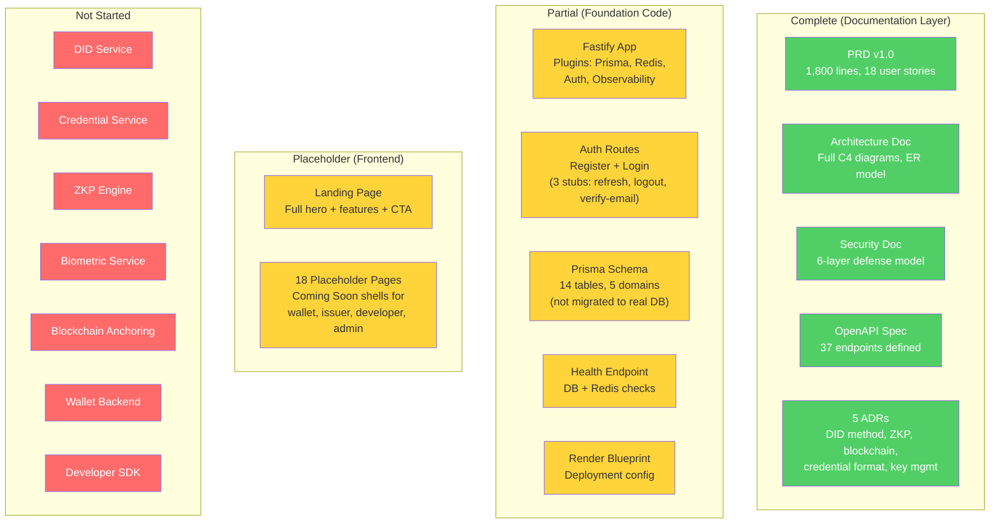

### Honest Assessment

| Dimension | Score | Notes |
|-----------|-------|-------|
| **Documentation** | 9/10 | Exceptionally thorough PRD, architecture, security, ADRs |
| **Backend Foundation** | 3/10 | Fastify app + auth routes. No core identity services |
| **Frontend** | 2/10 | Landing page + 18 placeholder shells |
| **Identity Core** | 0/10 | DID, credential, ZKP, biometric services not started |
| **Blockchain** | 0/10 | Not connected to Polygon |
| **Developer Platform** | 0/10 | No SDK, no sandbox, no API keys |
| **Testing** | 1/10 | 1 health check test |
| **Deployment** | 2/10 | Render blueprint exists, not deployed |
| **Overall Completion** | ~5% | Strong vision, minimal execution |

### What This Means

HumanID has best-in-class documentation and architecture but minimal working code. The good news: the architecture is sound and aligns with market consensus. The challenge: we need to ship production-quality identity infrastructure, not just documents.

---

## 3. Market Opportunity

### Market Size (2025-2031)

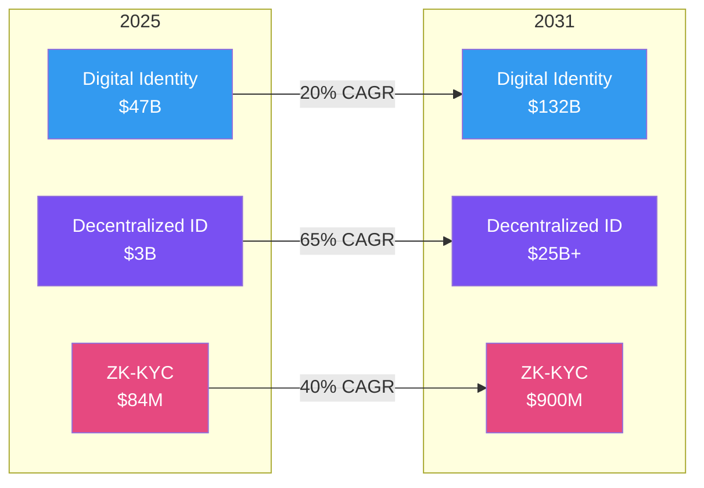

### Key Market Facts

| Metric | Value | Source |
|--------|-------|--------|
| Digital identity market (2025) | $47.4B | Precedence Research |
| Digital identity market (2031) | $132B | MarketsandMarkets |
| Decentralized identity (2025) | $3B | GM Insights |
| Decentralized identity CAGR | 65-70% | Multiple sources |
| ZK-KYC market (2025) | $83.6M | Grand View Research |
| EU citizens getting wallets by Dec 2026 | 450M | eIDAS 2.0 |
| Passkey adoption (consumers) | 69% | FIDO Alliance |
| Passkey adoption (enterprise) | 87% | HID/FIDO |
| US mobile driver's licenses in circulation | 5M+ | State programs |
| India Aadhaar e-KYC transactions/month | 446M | UIDAI |
| EU credential pilot adoption rate | 70-85% | POTENTIAL pilot |
| W3C VC 2.0 | Ratified standard (2025) | W3C |
| Gartner: digital ID wallet users by 2026 | 500M | Gartner |

### Five Market Tailwinds

1. **Regulatory mandates**: EU (EUDI wallets Dec 2026), India (DPDP Act), US (18 states with mDLs), UK (GOV.UK Wallet by 2029)
2. **AI proliferation**: AI agents need verifiable human identity. "Proof of humanness" is a billion-dollar use case
3. **Privacy backlash**: GDPR fines totaling EUR 5.88B. Enterprises need privacy-by-design identity solutions
4. **Developer-led adoption**: Stripe, Twilio, Auth0 proved that developer-first platforms win markets
5. **Standards maturity**: W3C VC 2.0 and DID Core 1.0 are ratified. The standards debate is over -- it is time to build

### HumanID's Addressable Market

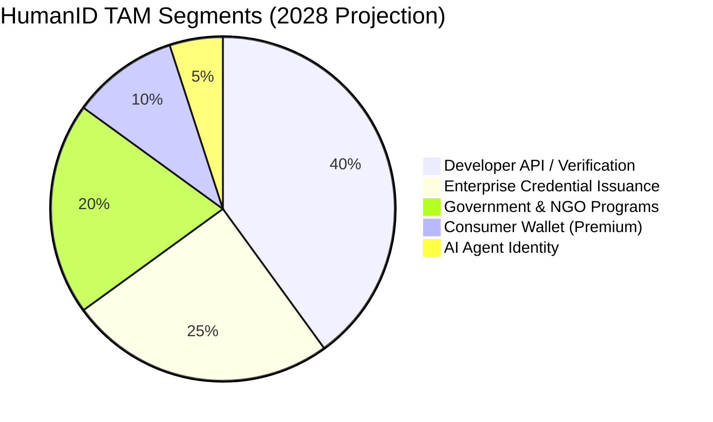

| Segment | 2028 TAM | HumanID SOM | Revenue Model |
|---------|----------|-------------|---------------|
| Developer API | $8B | $20-50M | Per-verification fee |
| Enterprise Issuance | $5B | $10-30M | SaaS subscription |
| Government & NGO | $4B | $5-15M | Contract / license |
| Consumer Premium | $2B | $2-5M | Freemium |
| AI Agent Identity | $500M | $1-3M | Per-agent fee |
| **Total** | **$19.5B** | **$38-103M** | |

---

## 4. Competitive Landscape

### Competitive Positioning Matrix

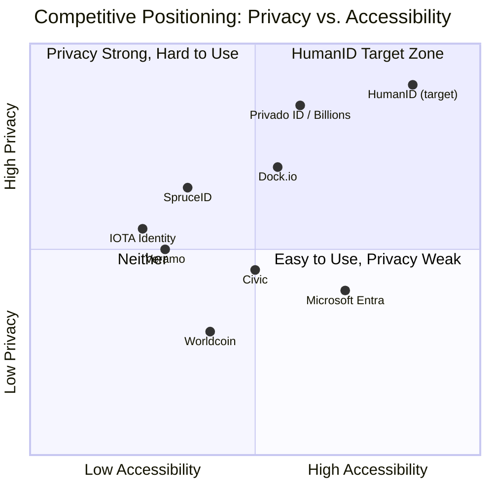

### Detailed Competitive Comparison

| Capability | HumanID | Worldcoin | Privado ID | MS Entra | Civic |
|---|---|---|---|---|---|
| **W3C VC 2.0** | Yes | No | Yes | Yes | No |
| **ZK Selective Disclosure** | Yes (Groth16) | Partial | Yes | No | No |
| **Biometric Proofing** | FIDO2/WebAuthn | Iris (Orb) | Passport NFC | Face Check | No |
| **No Special Hardware** | Yes | No (Orb) | Yes | Yes | Yes |
| **Developer API** | 37 endpoints | Yes | Yes | Yes | Yes |
| **Consumer Wallet** | Yes | Yes | Yes (Billions) | No | Yes |
| **Token Required** | No | Yes (WLD) | Planned | No | Yes (CVC) |
| **EUDI Ready** | Planned | No | EU Sandbox | Enterprise | No |
| **Blockchain Anchoring** | Yes (Polygon) | Yes (World Chain) | Yes (multi) | No | Yes (Solana) |
| **AI Agent Identity** | Roadmap | No | Roadmap | No | Roadmap |
| **Users** | 0 (pre-launch) | 33M app / 15M verified | 4M+ creds | Enterprise | 1M verifications |

### Key Competitor Vulnerabilities

| Competitor | Primary Vulnerability | HumanID Exploit |
|---|---|---|
| **Worldcoin** | Banned in multiple countries. Requires Orb. GDPR nightmare | "Privacy-first identity. No iris scans. No surveillance." |
| **Privado ID** | Brand confusion (3 names in 2 years). Web3-centric | Clean brand. Developer-first for Web2 AND Web3 |
| **Microsoft Entra** | Azure lock-in. No self-sovereignty. No ZKP | "Your identity, not Microsoft's. Works anywhere." |
| **Civic** | Tiny ($49M mcap). Solana-only. No W3C. No ZKP | Standards-based. Chain-agnostic. Full privacy |
| **SpruceID** | Toolkit, not platform. No hosted service | Full platform with hosted API. Stripe model |
| **Dock.io** | Low awareness. Opaque pricing. No consumer product | Transparent pricing. Consumer + developer + enterprise |

---

## 5. Strategic Vision

### 3-Year Vision (2026-2029)

> **By 2029, HumanID is the default identity verification layer for the internet -- the identity equivalent of what Stripe is to payments. Every developer who needs to verify a human integrates HumanID. Every person who needs a portable digital ID uses HumanID. Every enterprise that needs compliant identity verification deploys HumanID.**

### Strategic Objectives

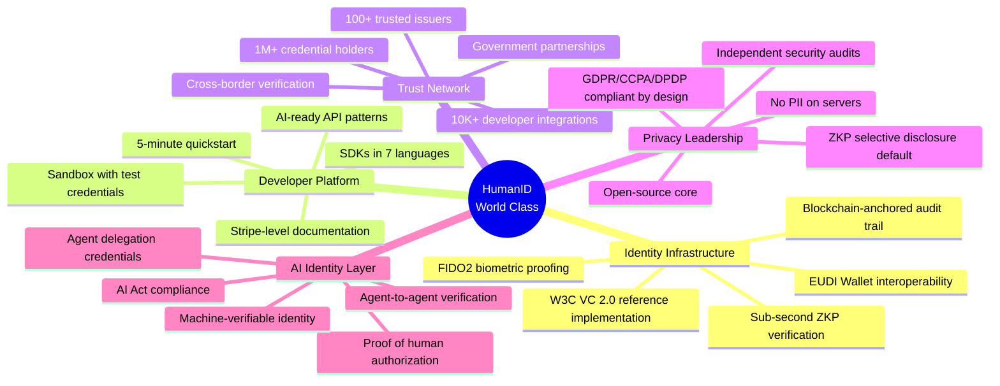

### What "World Class" Means for HumanID

| Dimension | World-Class Standard | How We Get There |
|-----------|---------------------|------------------|
| **Developer Experience** | 5-minute integration. Stripe-quality docs. | SDK-first development. Interactive API explorer. Test mode. |
| **Privacy** | Mathematically proven. Not just policy. | ZKP selective disclosure as default. Open-source ZK circuits. |
| **Standards** | Reference implementation of W3C specs | Active W3C participation. First to implement new specs. |
| **Performance** | Sub-2-second verification. Sub-5-second ZK proofs. | Optimized circuits. WASM compilation. Edge deployment. |
| **Security** | Zero critical vulnerabilities. Annual pen tests. | Security-first culture. Bug bounty program. SOC 2 Type II. |
| **Accessibility** | Works for 8B people. No special hardware. | Phone + face proofing. Offline mode. 10+ languages. |
| **Reliability** | 99.99% API uptime. | Multi-region deployment. Circuit breaker patterns. |
| **Ecosystem** | 100+ issuers, 10K+ developers, 1M+ holders | Developer advocacy. Issuer partnerships. Network effects. |

---

## 6. Competitive Moats

### Moat Strategy: Build Deep, Not Wide

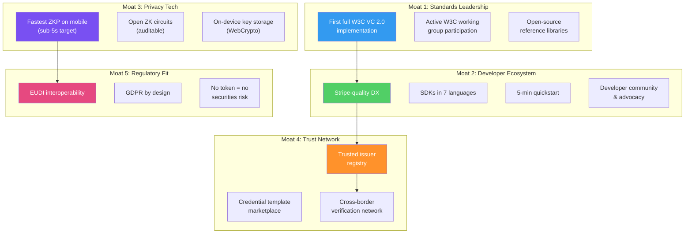

### Why These Moats Compound

1. **Standards leadership** attracts developers who want to build on the right foundation
2. **Developer ecosystem** creates integration lock-in (switching costs increase with each integration)
3. **Privacy tech** provides a cryptographic guarantee competitors cannot match without ZKP expertise
4. **Trust network** exhibits network effects (more issuers = more credentials = more verifiers = more holders)
5. **Regulatory fit** removes enterprise purchasing objections (no token risk, GDPR proven)

---

## 7. Phased Roadmap

### Overview: 6 Horizons

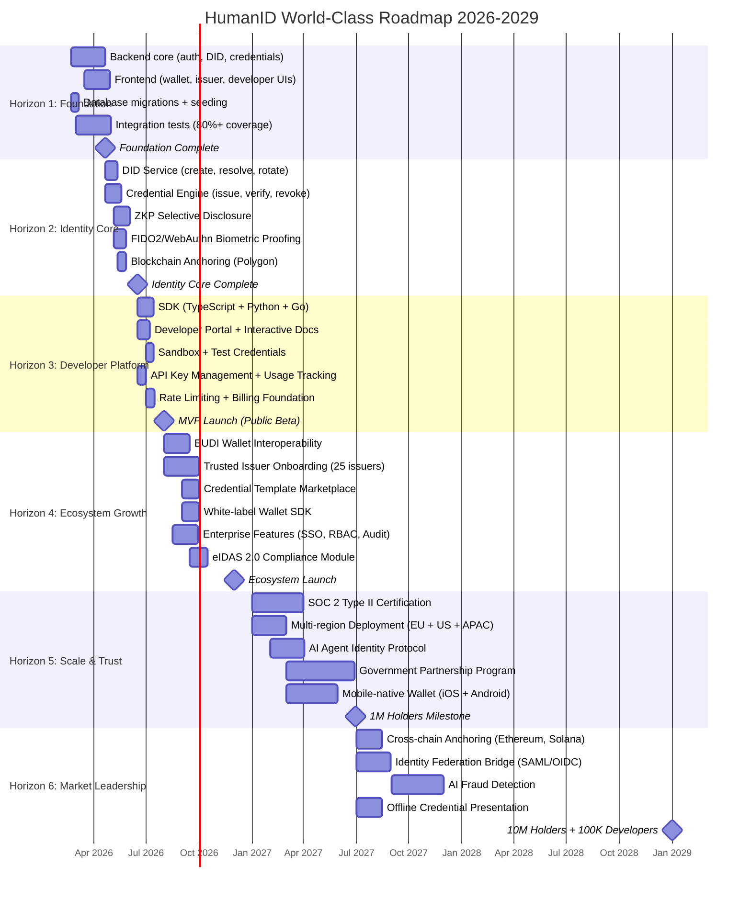

---

### Horizon 1: Foundation (Feb-Apr 2026) -- 8 weeks

**Goal**: Working backend + frontend with real database, auth, and core API endpoints.

| Task | Description | Priority |
|------|-------------|----------|
| Complete auth routes | Implement refresh, logout, verify-email (currently stubs) | P0 |
| Database migration | Run Prisma migrations, seed test data | P0 |
| DID CRUD endpoints | `/api/v1/dids` -- create, resolve, update, deactivate | P0 |
| Credential endpoints | `/api/v1/credentials` -- issue, list, get, revoke | P0 |
| Wallet endpoints | `/api/v1/wallet` -- list credentials, sharing history | P0 |
| Frontend: Auth pages | Login, register, verify-email with real API integration | P0 |
| Frontend: Wallet UI | Credential list, credential detail, sharing history | P0 |
| Frontend: Issuer dashboard | Issue credential, view issued, templates | P1 |
| Integration tests | 80%+ coverage on all backend routes | P0 |
| E2E tests | Playwright smoke tests for critical flows | P1 |

**Exit Criteria**: User can register, log in, create a DID, receive a credential, and view it in the wallet. 80%+ test coverage. All critical flows tested E2E.

---

### Horizon 2: Identity Core (Apr-Jun 2026) -- 8 weeks

**Goal**: The cryptographic identity engine that makes HumanID unique.

| Task | Description | Priority |
|------|-------------|----------|
| DID Service | Ed25519 key generation, DID document management, key rotation | P0 |
| Credential Engine | W3C VC 2.0 issuance, Ed25519Signature2020, JSON-LD | P0 |
| ZKP Engine | snarkjs/circom circuits for age proof, membership proof, attribute proof | P0 |
| ZKP optimization | Target sub-5-second proof generation on mobile (WASM) | P0 |
| FIDO2/WebAuthn | Biometric enrollment, authentication, device binding | P0 |
| Blockchain Anchoring | Polygon L2 integration for DID creation, issuance, revocation events | P1 |
| Verification Engine | 4-step verification: signature, issuer trust, revocation, expiry | P0 |
| Presentation Protocol | Holder creates VP from VCs, verifier validates | P0 |

**Exit Criteria**: Full identity lifecycle works end-to-end. ZKP proofs generate in <5s on mobile. FIDO2 enrollment succeeds on Chrome/Safari/Firefox. At least 3 credential types verified.

---

### Horizon 3: Developer Platform (Jun-Jul 2026) -- 6 weeks

**Goal**: Make HumanID as easy to integrate as Stripe. This is the primary GTM lever.

| Task | Description | Priority |
|------|-------------|----------|
| TypeScript SDK | `@humanid/sdk` -- npm package with full API coverage | P0 |
| Python SDK | `humanid-python` -- PyPI package | P1 |
| Go SDK | `humanid-go` -- for enterprise backends | P2 |
| Developer Portal | Interactive API docs with "Try It" feature | P0 |
| API Explorer | Swagger UI with authentication, request/response examples | P0 |
| Sandbox Environment | Test mode with synthetic credentials, no rate limits | P0 |
| Test Credentials | Pre-generated test DIDs, VCs for sandbox use | P0 |
| API Key Management | Create, rotate, revoke keys. Usage dashboard | P0 |
| Request Logs | Searchable API request/response logs for debugging | P1 |
| 5-Minute Quickstart | Guide: install SDK, verify first credential, 15 lines of code | P0 |
| Rate Limiting Tiers | Sandbox (100/hr), Production (10K/hr), Enterprise (custom) | P1 |

**Exit Criteria**: Developer can go from zero to first verified credential in under 5 minutes. SDK covers 100% of API surface. Interactive docs available. Sandbox works without sign-up.

**MVP PUBLIC BETA LAUNCH** -- July 31, 2026

---

### Horizon 4: Ecosystem Growth (Aug-Nov 2026) -- 16 weeks

**Goal**: Build the trust network. Onboard issuers. Enable enterprise. Achieve EUDI interoperability before the December 2026 mandate.

| Task | Description | Priority |
|------|-------------|----------|
| EUDI Wallet Interoperability | HumanID credentials presentable in any EUDI wallet | P0 |
| eIDAS 2.0 Compliance Module | Qualified electronic attestations of attributes | P0 |
| Trusted Issuer Program | Onboard 25 issuers (universities, employers, professional bodies) | P0 |
| Credential Template Marketplace | Browse, discover, and use credential schemas | P1 |
| White-label Wallet SDK | Embed HumanID wallet in third-party apps | P1 |
| Enterprise SSO Integration | SAML/OIDC bridge for enterprise customers | P1 |
| Enterprise RBAC | Role-based access for issuer organizations | P1 |
| Audit Trail Dashboard | Compliance-grade audit logs for enterprise | P1 |
| Webhook Notifications | Real-time events for verification, issuance, revocation | P1 |
| Billing System | Usage-based billing with Stripe integration | P2 |

**Exit Criteria**: 25+ trusted issuers onboarded. EUDI interoperability demonstrated. Enterprise features deployed. First paying customers.

---

### Horizon 5: Scale & Trust (Jan-Jun 2027) -- 6 months

**Goal**: Establish institutional trust. Scale globally. Introduce AI agent identity.

| Task | Description | Priority |
|------|-------------|----------|
| SOC 2 Type II | Independent audit and certification | P0 |
| Multi-region deployment | EU (Frankfurt), US (Virginia), APAC (Singapore) | P0 |
| AI Agent Identity Protocol | Agent delegation credentials, proof-of-human-authorization | P0 |
| Government Partnership Program | Credential issuance for government ID programs | P1 |
| Mobile-native wallet | iOS (Swift) + Android (Kotlin) with Secure Enclave | P1 |
| Bug Bounty Program | Public security research program (HackerOne) | P1 |
| ISO 27001 Certification | Information security management | P2 |
| Offline credential presentation | BLE/NFC credential exchange without internet | P2 |

**Exit Criteria**: SOC 2 Type II certified. Multi-region live. AI agent identity protocol published. 1M credential holders. 10K developer accounts.

---

### Horizon 6: Market Leadership (Jul 2027-2029) -- 18 months

**Goal**: Become the default identity infrastructure for the internet.

| Task | Description | Priority |
|------|-------------|----------|
| Cross-chain anchoring | Ethereum mainnet, Solana, Arbitrum support | P1 |
| Identity federation bridge | Bidirectional SAML/OIDC to DID/VC bridge | P1 |
| AI fraud detection | ML-based credential fraud pattern detection | P2 |
| Organizational DIDs | Identity for companies, departments, devices | P1 |
| Delegated issuance | Sub-entity credential issuance rights | P2 |
| Decentralized governance | Community governance for protocol evolution | P3 |
| 20+ language support | Full i18n coverage | P2 |

**Exit Criteria**: 10M+ holders. 100K+ developers. 500+ issuers. $50M+ ARR. Market-recognized leader.

---

## 8. Go-to-Market Strategy

### GTM Model: Developer-Led Growth (DLG)

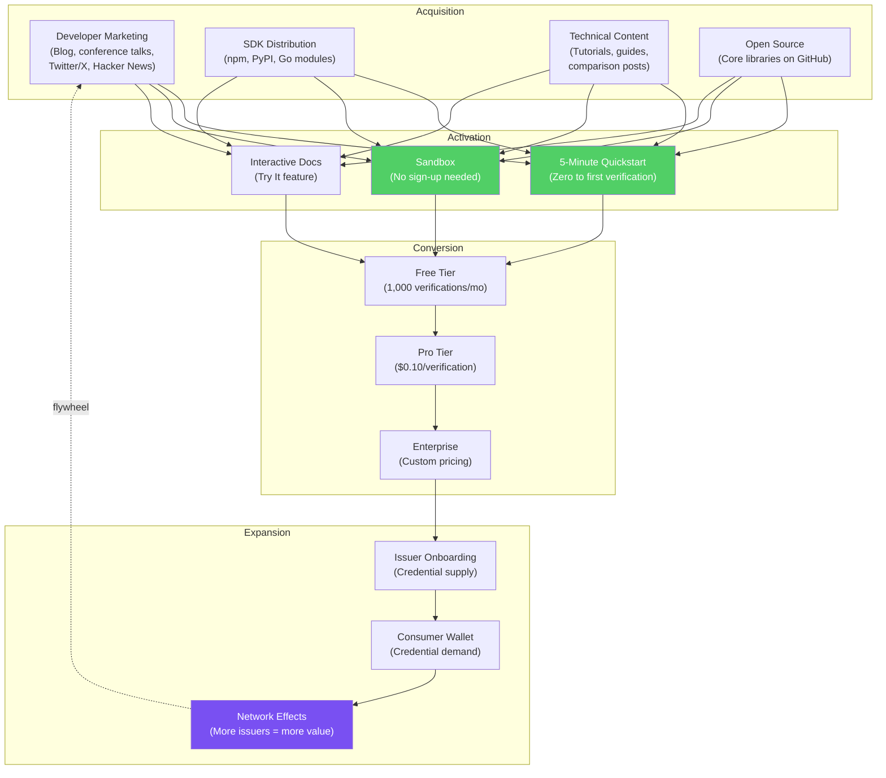

### GTM Phases

| Phase | Timeline | Focus | Key Activities |
|-------|----------|-------|----------------|
| **Phase 1: Seed** | Jul-Sep 2026 | Developer awareness | Launch blog, publish quickstart, submit to Hacker News, dev conference talks |
| **Phase 2: Grow** | Oct-Dec 2026 | Issuer onboarding | Partner with 5 universities, 5 employers, 5 professional bodies. EUDI demo |
| **Phase 3: Scale** | Jan-Jun 2027 | Enterprise sales | Direct sales to regulated industries (finance, healthcare). SOC 2 as sales tool |
| **Phase 4: Network** | Jul 2027+ | Ecosystem flywheel | Consumer wallet marketing. Government partnerships. Cross-border verification |

### Target Customers by Phase

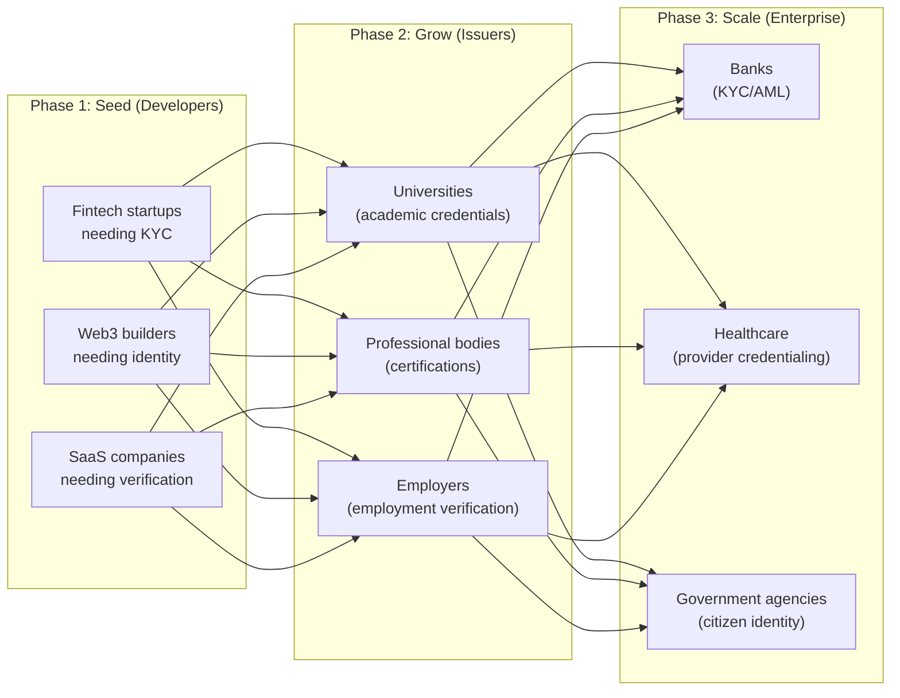

### Worldcoin Backlash Strategy

Every Worldcoin controversy is a HumanID opportunity. Marketing should be ready to publish comparison content within 48 hours of any:
- Country ban or regulatory action against Worldcoin
- GDPR fine or investigation of Worldcoin
- Privacy backlash against iris scanning
- AI-generated content controversy (proof of humanness debate)

**Key messages**:
- "Identity without surveillance"
- "Verify humans without scanning irises"
- "W3C standards, not proprietary protocols"
- "Your identity, your device, your control"

---

## 9. Revenue Model

### Pricing Tiers

| Tier | Price | Includes | Target |
|------|-------|----------|--------|
| **Free** | $0/month | 1,000 verifications/mo, sandbox, 1 API key | Individual developers, POCs |
| **Pro** | $99/month + $0.10/verification | 10,000 verifications/mo, 5 API keys, request logs, priority support | Startups, SMBs |
| **Enterprise** | Custom | Unlimited verifications, SLA, dedicated support, RBAC, SSO, audit trails | Large organizations |
| **Government** | Custom | White-label, on-premises option, compliance certifications | Government agencies |

### Revenue Projections

| Year | Developers | Holders | Verifications/mo | ARR |
|------|-----------|---------|-------------------|-----|
| 2026 (H2) | 500 | 10K | 50K | $100K |
| 2027 | 5K | 100K | 1M | $3M |
| 2028 | 25K | 1M | 10M | $20M |
| 2029 | 100K | 10M | 100M | $100M |

### Unit Economics (Target at Scale)

| Metric | Target |
|--------|--------|
| Cost per verification | $0.02 |
| Revenue per verification | $0.10 |
| Gross margin | 80% |
| Developer CAC | $50 |
| Developer LTV | $2,000 |
| LTV/CAC ratio | 40x |

---

## 10. Key Partnerships

### Partnership Strategy

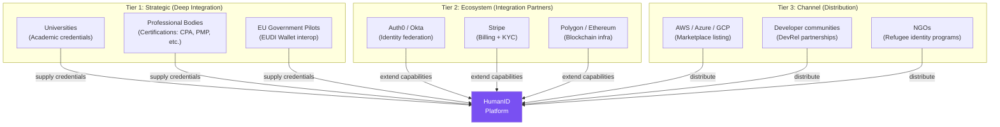

### Priority Partnerships (First 12 Months)

| Partner Type | Targets | Value to HumanID | Timeline |
|---|---|---|---|
| **3 Universities** | RWTH Aachen, UCL, NUS | Academic credential supply. Research credibility | Q3 2026 |
| **2 Professional Bodies** | PMI, (ISC)2 | Professional certification credentials | Q4 2026 |
| **1 EU Pilot** | POTENTIAL consortium follow-on | EUDI interoperability validation | Q3 2026 |
| **FIDO Alliance** | Membership | Standards credibility. WebAuthn integration support | Q2 2026 |
| **W3C** | Working group participation | Standards influence. Reference implementation status | Q2 2026 |

---

## 11. Success Metrics

### North Star Metric

> **Verified credential interactions per month** -- the total number of successful credential verifications across the HumanID platform. This captures the network effect: more holders + more issuers + more verifiers = exponential verification growth.

### KPIs by Horizon

| Horizon | Timeline | Key Metrics | Targets |
|---------|----------|-------------|---------|
| **H1: Foundation** | Feb-Apr 2026 | Tests passing, coverage, endpoint count | 200+ tests, 80%+ coverage, 20+ endpoints |
| **H2: Identity Core** | Apr-Jun 2026 | ZKP proof time, verification latency, DID count | <5s proof, <2s verify, 100 test DIDs |
| **H3: Developer Platform** | Jun-Jul 2026 | Quickstart time, SDK downloads, sandbox usage | <5 min, 1K downloads, 500 sandbox sessions |
| **H4: Ecosystem** | Aug-Nov 2026 | Issuers, credentials issued, EUDI interop | 25 issuers, 50K creds, EUDI demo |
| **H5: Scale** | Jan-Jun 2027 | Holders, developers, uptime, revenue | 1M holders, 10K devs, 99.99%, $3M ARR |
| **H6: Leadership** | Jul 2027-2029 | Market share, NPS, credential types | Top 3 platform, NPS>50, 100+ types |

### Quality Metrics

| Metric | Target | Measurement |
|--------|--------|-------------|
| API uptime | 99.99% | Monitoring (Datadog) |
| Verification p95 latency | <2 seconds | APM |
| ZKP proof generation (mobile) | <5 seconds | Client telemetry |
| DID creation p95 latency | <3 seconds | APM |
| Developer NPS | >50 | Quarterly survey |
| Time to first verification | <5 minutes | Onboarding analytics |
| Critical security vulnerabilities | 0 | Pen test + bug bounty |
| Test coverage | >90% | CI pipeline |

---

## 12. Risks and Mitigations

### Strategic Risks

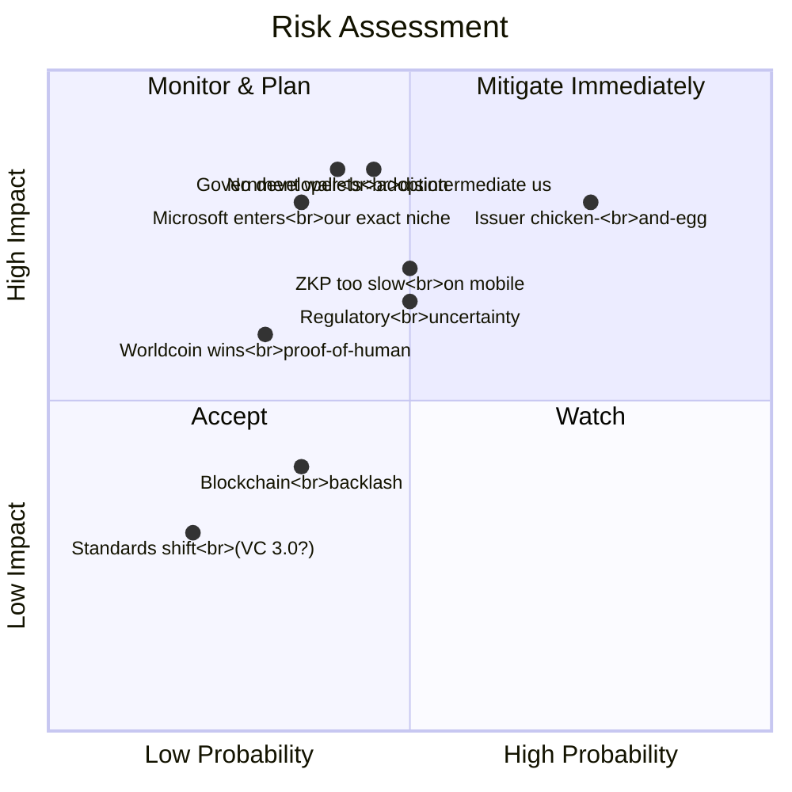

### Top 5 Risks and Mitigations

| # | Risk | Probability | Impact | Mitigation |
|---|------|-------------|--------|------------|
| 1 | **Issuer chicken-and-egg**: No issuers = no credentials = no holders | High | Critical | Pre-seed with 3-5 university partners before launch. Offer free issuer accounts for Year 1. Create demo credentials. Gamify early adoption ("HumanID Pioneer" credential) |
| 2 | **No developer adoption**: If developers don't integrate, nothing else matters | Medium | Critical | Stripe-level DX. Free tier. 5-min quickstart. Developer advocacy program. Open-source core libraries |
| 3 | **Government wallets displace private platforms**: EU/UK wallets become the default | Medium | High | Position as complement, not competitor. Be the cross-border bridge. Offer issuer tools that work with government wallets |
| 4 | **ZKP performance**: Proof generation too slow for consumer flows | Medium | High | Invest in circuit optimization. WASM compilation. Pre-computation. Fall back to standard selective disclosure if ZKP is too slow |
| 5 | **Microsoft enters our niche**: Entra adds ZKP and consumer wallet | Low-Med | High | Move faster. Build developer loyalty. Open-source moat. Community governance. Be where Microsoft cannot (non-Azure, non-enterprise, consumer) |

---

## 13. Resource Requirements

### Engineering Team (Recommended)

| Role | H1-H3 (Foundation-MVP) | H4-H5 (Growth) | H6 (Leadership) |
|------|------------------------|-----------------|------------------|
| Backend Engineer | 2 | 3 | 4 |
| Frontend Engineer | 1 | 2 | 3 |
| Cryptography Engineer | 1 | 1 | 2 |
| Mobile Developer | 0 | 0 | 2 |
| DevOps/SRE | 1 | 1 | 2 |
| QA Engineer | 1 | 1 | 2 |
| **Total Engineering** | **6** | **8** | **15** |

### Non-Engineering

| Role | When | Why |
|------|------|-----|
| Developer Advocate | H3 (MVP launch) | Developer marketing, community, content |
| Security Engineer | H4 | SOC 2 prep, pen testing, bug bounty |
| Product Manager | H4 | Feature prioritization, user research |
| Partnerships Lead | H4 | Issuer onboarding, government relationships |
| Sales (Enterprise) | H5 | Direct enterprise sales |

### Infrastructure Costs (Monthly Estimate)

| Service | H1-H3 | H4-H5 | H6 |
|---------|--------|--------|-----|
| Cloud (Render/AWS) | $200 | $2K | $20K |
| PostgreSQL | $50 | $500 | $5K |
| Redis | $30 | $200 | $2K |
| Polygon (gas) | $10 | $100 | $1K |
| SendGrid | $20 | $200 | $1K |
| Monitoring | $0 | $500 | $2K |
| **Total** | **$310** | **$3.5K** | **$31K** |

---

## 14. Decision Points for CEO

### Immediate Decisions Needed

| # | Decision | Options | Recommendation | Why |
|---|----------|---------|----------------|-----|
| 1 | **Start building now?** | Yes / Wait for more planning | **Yes** | Documentation is complete. Architecture is sound. Market is moving fast. EUDI deadline is 10 months away |
| 2 | **Build order** | Identity core first / Developer platform first | **Identity core first** | Cannot demo developer platform without working identity. H1 (foundation) + H2 (identity core) must precede H3 (developer platform) |
| 3 | **Open-source strategy** | Core open / Everything proprietary / Dual license | **Core open, platform proprietary** | Open-source ZK circuits and DID libraries build trust and community. Keep the hosted platform, SDK, and enterprise features proprietary |
| 4 | **Token?** | Yes (utility token) / No | **No** | Tokens create regulatory risk, alienate enterprise buyers, and distract from the product. Stripe does not have a token. Neither should HumanID |
| 5 | **First vertical** | Developer platform / Healthcare / Education / Finance | **Education (universities)** | Universities are the easiest issuers to onboard (academic credentials). Low sales friction. High credential volume. Validates the system before enterprise |
| 6 | **EUDI priority** | H4 (Aug-Nov 2026) / Defer to H5 | **H4 -- keep it in Aug-Nov 2026** | The Dec 2026 mandate is the single biggest market-shaping event. Being ready by November positions HumanID for the wave |

### Checkpoint Schedule

| Checkpoint | When | What CEO Reviews |
|------------|------|------------------|
| Foundation Complete | Apr 2026 | Working app: register, login, DID, credentials, wallet |
| Identity Core Complete | Jun 2026 | ZKP proofs, FIDO2 enrollment, blockchain anchoring |
| MVP Launch Decision | Jul 2026 | Developer platform quality, documentation, SDK |
| First Issuers | Oct 2026 | Partnership agreements, credential templates |
| EUDI Demo | Nov 2026 | Interoperability with EU wallet specification |
| Enterprise Readiness | Mar 2027 | SOC 2 progress, enterprise feature set |

---

## Appendix A: What Makes This Plan "World Class" vs. "Just Another Identity Platform"

| Dimension | Mediocre Platform | World-Class Platform (HumanID Target) |
|-----------|-------------------|--------------------------------------|
| **Integration** | 2 days to integrate | **5 minutes** to first verification |
| **Documentation** | API reference only | **Interactive docs** with live examples, tutorials, use-case guides |
| **Privacy** | "We don't share your data" (policy) | **ZKP proves it mathematically** (cryptography) |
| **Standards** | Partial W3C support | **Reference implementation** of W3C VC 2.0 |
| **Performance** | 30-60s verification | **<2s verification, <5s ZKP proof** |
| **Reach** | Requires passport or government ID | **Phone + face** (reaches 1.1B without documents) |
| **Enterprise** | "Contact us" | **Self-serve** up to 10K verifications/mo, enterprise from there |
| **Regulatory** | "We're working on GDPR" | **GDPR compliance is architecturally impossible to violate** |
| **Ecosystem** | Closed platform | **Open-source core** + credential marketplace + issuer network |

---

*Strategy prepared by KarimSW Orchestrator + Product Strategist*
*Based on competitive intelligence and market research conducted February 20, 2026*
*Next review: May 2026 (quarterly strategy review)*
